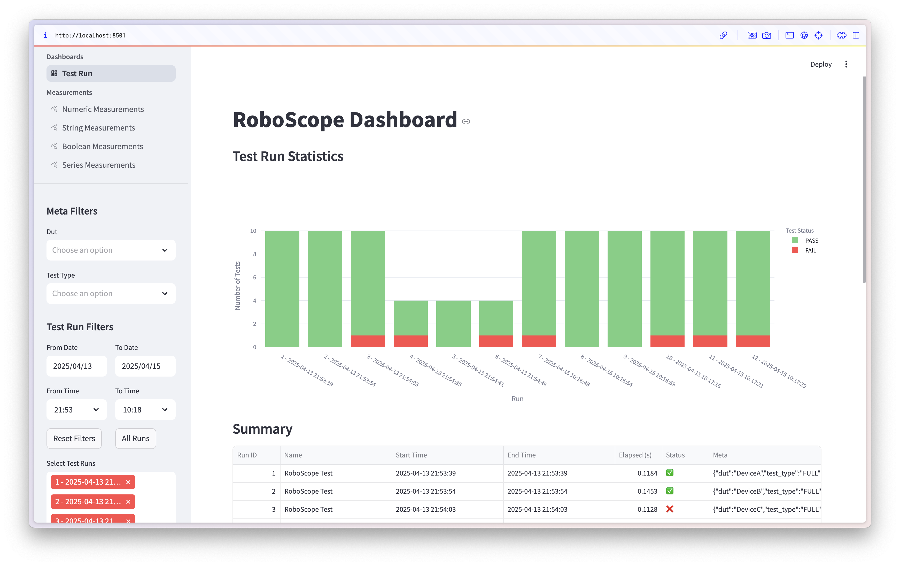
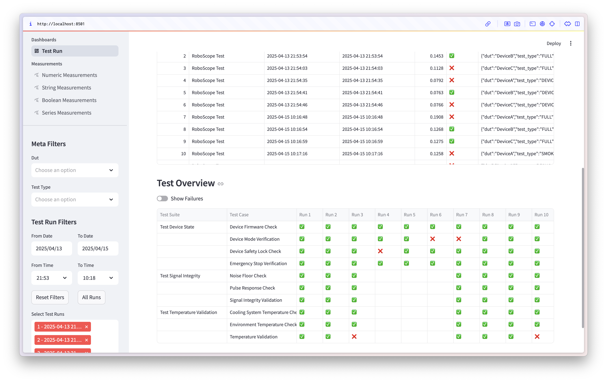
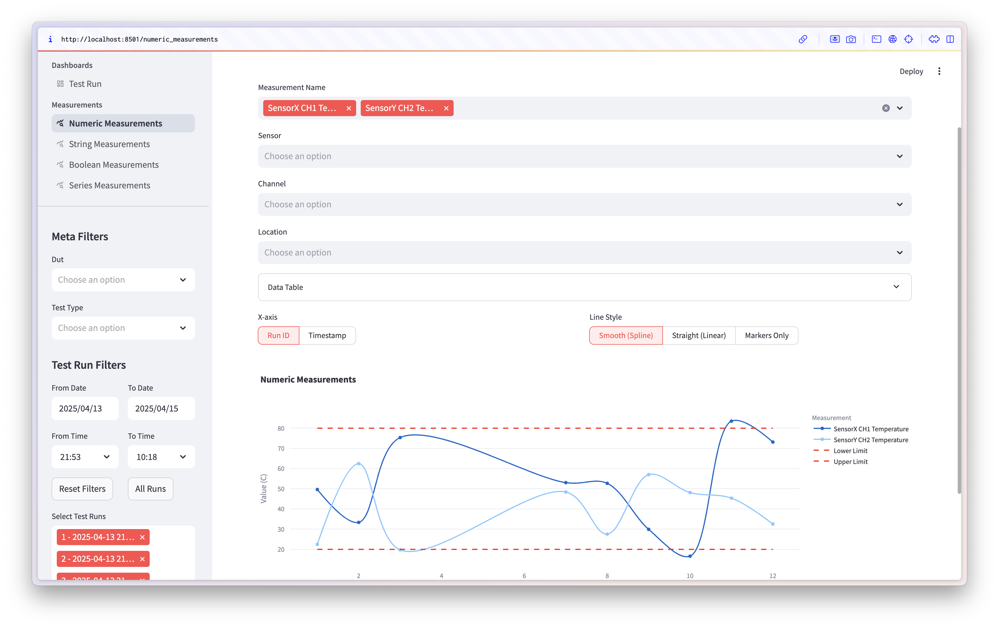
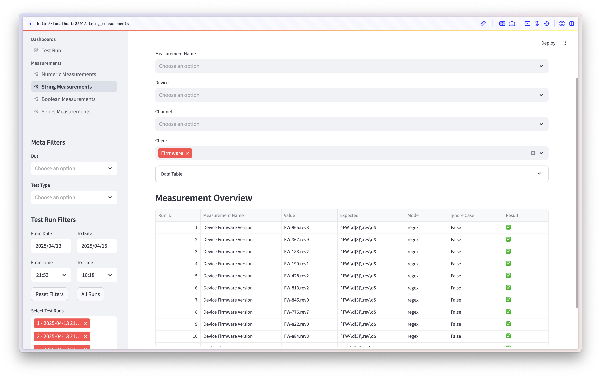
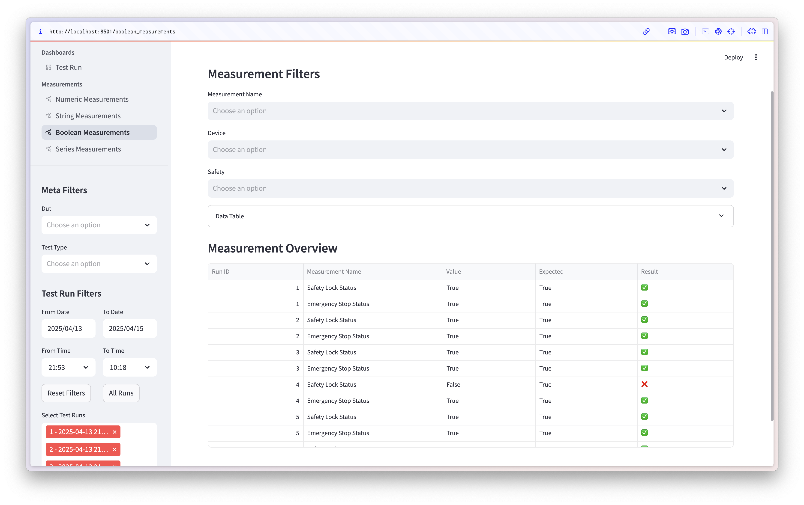
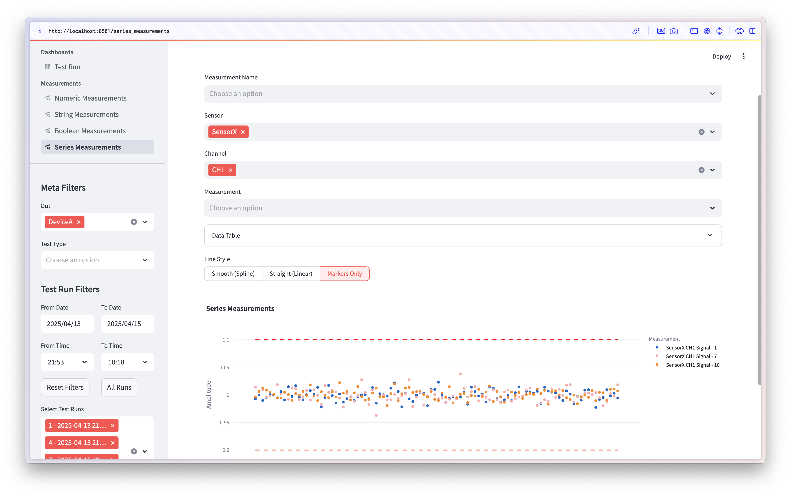

# RoboScope UI

**RoboScope UI** is a Streamlit-based UI for exploring, analyzing, and visualizing test results recorded with [RoboScope](https://github.com/geomags3/roboscope).  
It allows hardware teams to inspect structured measurement data (numeric, string, boolean, series) with flexible filters and intuitive charts.

🚀 **Live Demo**: [roboscope-ui.streamlit.app](https://roboscope-ui.streamlit.app)

## 🔍 Key Features

- 📊 **Dashboards** for Test Run summaries and Test Case statuses
- 📐 **Measurement views** for:
  - Numeric values with limits and plots
  - String and Boolean evaluations
  - Series data with line charts and bounds
- 🎛️ **Powerful filter sidebar**: Date/time, metadata, DUT, measurement name
- 🧩 Easily extensible: Add custom Streamlit pages for new measurement types
- 🔌 Connects to **SQLite or PostgreSQL** databases populated by RoboScope listener or library

---

## ⚙️ Quick Start

1. **Install dependencies**
   ```bash
   pip install -e .
   ```

2. **Launch the app**
   ```bash
   streamlit run app.py -- --db_url=sqlite:///results.db
   ```
   or set the database URL in the `.streamlit/secrets.toml` file:
   ```toml
   db_url = "sqlite:///results.db"
   ```

3. **Browse dashboards and measurements** at `http://localhost:8501`

## 📊 Dashboards
- **Test Run Summary**: Displays the status of all test runs with a summary of test cases.

## 📐 Measurements
- **Numeric**: Displays numeric values with limits and plots.
- **String**: Displays string evaluations.
- **Boolean**: Displays boolean evaluations.
- **Series**: Displays series data with line charts and bounds.

> **Note**: The app is designed to be extensible. You can add custom Streamlit pages for new dashboards or measurements by creating new Python files in the `dashboards` or `measurements` directories, and updating the `app.py` file to include them.

## 🧠 Designed For
- Hardware test engineers and developers
- Teams using Robot Framework to test devices, systems, or embedded software
- Anyone building automated test infrastructure with structured measurements

## 🛠️ Built With
- [RoboScope](https://github.com/geomags3/roboscope): Core test result recorder for Robot Framework
- [Robot Framework](https://robotframework.org/): Generic test automation framework
- [SQLite](https://www.sqlite.org/index.html): Lightweight database for local testing
- [PostgreSQL](https://www.postgresql.org/): Powerful database for production use
- [Streamlit](https://streamlit.io/): Open-source app framework for Machine Learning and Data Science projects

## 🖼️ Screenshots

### Test Run Summary


### Test Run Overview


### Numeric Measurements


### String Measurements


### Boolean Measurements


### Series Measurements


## 📜 License
MIT License © 2025 Mykyta Didenko - Feel free to use, fork, and modify this project as you wish. Contributions are welcome!
